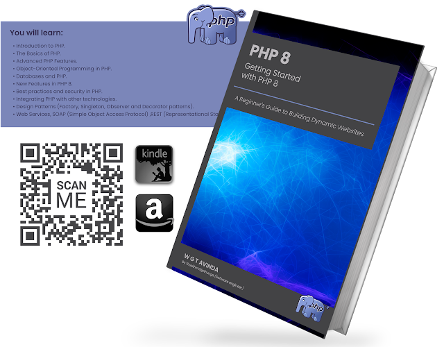

# Getting-Started-with-PHP-8

Getting Started with PHP 8: A Beginner's Guide to Building Dynamic Websites

If you're new to PHP, or looking to brush up on your skills, **Getting Started with PHP 8** is the perfect place to start. This beginner's guide to building dynamic websites will take you step-by-step through the basics of PHP and provide you with the knowledge and skills you need to start building your own web applications.

The book covers a wide range of topics, including:

- **Setting up your development environment**: You will learn how to install and configure PHP on your computer, and how to use popular tools such as XAMPP and WAMP.

- **PHP Basics**: The book covers the fundamentals of PHP, including syntax, data
types, variables, and functions. You will also learn how to work with arrays, loops, and conditional statements.

- **Working with Forms and Databases**: You will learn how to build web forms and submit data to a PHP script, as well as how to connect to a MySQL database and perform basic CRUD (create, read, update, delete) operations.

- **Object-Oriented PHP**: The book covers object-oriented programming concepts and how to use them in PHP. You will learn how to create classes and objects, and how to work with inheritance and interfaces.

-  **Advanced Topics**: The book covers advanced topics such as error handling, file handling, sessions, and cookies.
Throughout the book, you will find practical examples

and exercises that will help you apply what you've learned. You will also learn how to build a complete web application using PHP and MySQL.

## Kindle eBook

- [Read On Amazon United States](https://www.amazon.com/dp/B0BVJJRWKR)
- [Read On Amazon United Kingdom](https://www.amazon.co.uk/dp/B0BVJJRWKR)
- [Read On Amazon Germany](https://www.amazon.de/dp/B0BVJJRWKR)
- [Read On Amazon France](https://www.amazon.fr/dp/B0BVJJRWKR)
- [Read On Amazon El Salvador](https://www.amazon.es/dp/B0BVJJRWKR)
- [Read On Amazon Italy](https://www.amazon.it/dp/B0BVJJRWKR)
- [Read On Amazon Netherlands](https://www.amazon.nl/dp/B0BVJJRWKR)
- [Read On Amazon Japan](https://www.amazon.co.jp/dp/B0BVJJRWKR)
- [Read On Amazon Brazil](https://www.amazon.com.br/dp/B0BVJJRWKR)
- [Read On Amazon Canada](https://www.amazon.ca/dp/B0BVJJRWKR)
- [Read On Amazon Mexico](https://www.amazon.com.mx/dp/B0BVJJRWKR)
- [Read On Amazon Australia](https://www.amazon.com.au/dp/B0BVJJRWKR)
- [Read On Amazon India](https://www.amazon.in/dp/B0BVJJRWKR)

## Paperback

- [Read On Amazon United States](https://www.amazon.com/dp/B0BW3HQYSQ)
- [Read On Amazon United Kingdom](https://www.amazon.co.uk/dp/B0BW3HQYSQ)
- [Read On Amazon Germany](https://www.amazon.de/dp/B0BW3HQYSQ)
- [Read On Amazon France](https://www.amazon.fr/dp/B0BW3HQYSQ)
- [Read On Amazon El Salvador](https://www.amazon.es/dp/B0BW3HQYSQ)
- [Read On Amazon Italy](https://www.amazon.it/dp/B0BW3HQYSQ)
- [Read On Amazon Netherlands](https://www.amazon.nl/dp/B0BW3HQYSQ)
- [Read On Amazon Poland](https://www.amazon.pl/dp/B0BW3HQYSQ)
- [Read On Amazon Japan](https://www.amazon.co.jp/dp/B0BW3HQYSQ)
- [Read On Amazon Brazil](https://www.amazon.com.br/dp/B0BW3HQYSQ)
- [Read On Amazon Sweden](https://www.amazon.se/dp/B0BW3HQYSQ)
- [Read On Amazon Canada](https://www.amazon.ca/dp/B0BW3HQYSQ)
- [Read On Amazon Mexico](https://www.amazon.com.mx/dp/B0BW3HQYSQ)
- [Read On Amazon Australia](https://www.amazon.com.au/dp/B0BW3HQYSQ)

**Getting Started with PHP 8** for anyone who is new to PHP or looking to improve their PHP skills. 

This book is well-written, easy to follow, and provides a solid foundation for building dynamic websites with PHP.
So if you're ready to start your PHP journey, pick up a copy of **Getting Started with PHP 8** today! It's available in both Kindle and paperback versions on Amazon. 

